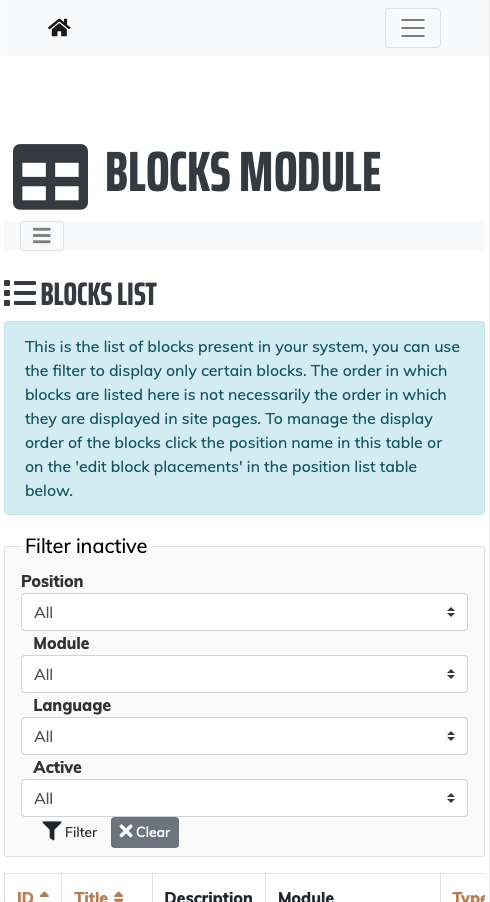

# Craigh\SimpleScrollTheme

SimpleScrollTheme is a MIT licensed theme for Zikula 3.*
It is based on _Resume_ created by David Miller and Start Bootstrap.

Resume is a resume and CV theme for Bootstrap created by Start Bootstrap.
This theme features a fixed sidebar with content sections to build a simple, yet elegant resume.

original design: https://startbootstrap.com/themes/resume/
License: MIT

graphic: https://commons.wikimedia.org/wiki/File:Luca_Pacioli,_De_divina_proportione,_Letter_S.jpg
This work is in the public domain in its country of origin and other countries and areas where the copyright term is the author's life plus 100 years or fewer
{{PD-US-expired}} – published anywhere before 1925 and public domain in the U.S. 

The original [README.md file](Resources/meta/README.md) is available.
Please note that asset locations have been moved to Zikula locations and so adjustment of the
instructions may be necessary.

